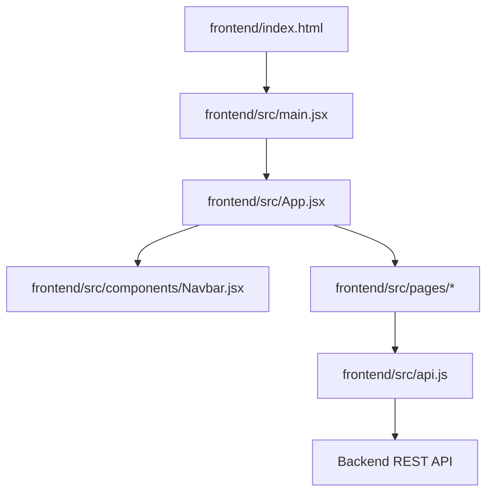
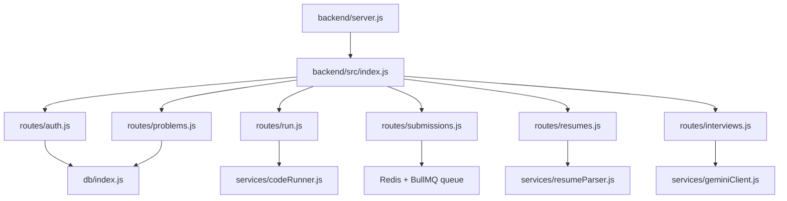
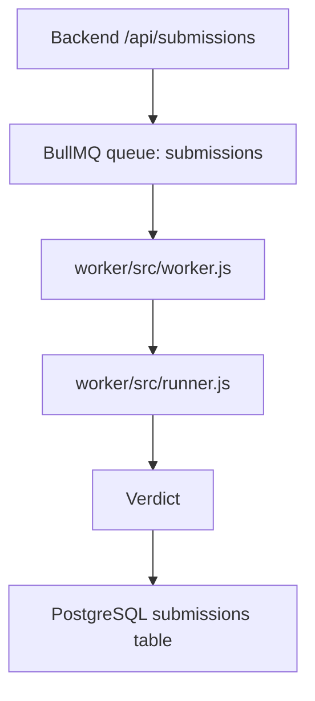
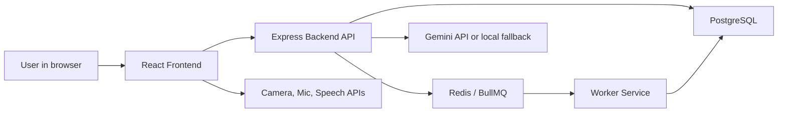

# Project File Map

This document explains how the main files are connected and what each file is responsible for. The order is:

1. Frontend
2. Backend
3. Worker
4. How everything connects

Generated dependency folders such as `node_modules` and build folders such as `dist` are not included here.

## Frontend

The frontend lives in `frontend/`. It is a React + Vite app.

### Frontend Entry Flow

### Frontend Files

| File | Connected To | Purpose |
| --- | --- | --- |
| `frontend/index.html` | `frontend/src/main.jsx` | Browser entry HTML. It contains the root div where React mounts. |
| `frontend/src/main.jsx` | `App.jsx`, `index.css` | Starts React, wraps the app in `BrowserRouter`, and loads global CSS. |
| `frontend/src/App.jsx` | `Navbar.jsx`, all page files | Main router. Decides which page renders for each URL and hides the navbar on selected routes such as the live interview room. |
| `frontend/src/components/Navbar.jsx` | `App.jsx`, `api.js` | Reusable navbar component. Controls brand, centered nav links, and login/logout action. |
| `frontend/src/api.js` | All pages that call the backend | Shared API helper. Adds JSON headers, auth token, and backend base URL handling. |
| `frontend/src/index.css` | `main.jsx` | Global browser reset and base element styles. |
| `frontend/src/App.css` | `App.jsx` | Main app styling for navbar, home page, workspace, auth pages, submissions, and interview UI. |
| `frontend/vite.config.js` | Vite | Frontend build and dev-server configuration. |
| `frontend/eslint.config.js` | ESLint | Frontend linting rules. |

### Frontend Pages

| Page File | Route | Connected To | Purpose |
| --- | --- | --- | --- |
| `frontend/src/pages/Home.jsx` | `/` | `App.jsx` | Landing page for `code.arr`. Includes the animated letter-by-letter hero text and platform sections. |
| `frontend/src/pages/Login.jsx` | `/login` | `api.js`, backend auth routes | Login/register page. Stores JWT token after successful auth. |
| `frontend/src/pages/Problems.jsx` | `/problems` | `api.js`, backend problems route | Shows available coding problems. Links users to the workspace. |
| `frontend/src/pages/Workspace.jsx` | `/problems/:slug` | `api.js`, backend problems/run/submissions routes | Coding workspace with Monaco Editor, run button, submit button, and test output. |
| `frontend/src/pages/Submissions.jsx` | `/submissions` | `api.js`, backend submissions route | Displays the logged-in user's submission history. |
| `frontend/src/pages/InterviewSetup.jsx` | `/interview` | `api.js`, backend resume route | AI interview first step: select domain and upload CV/resume. |
| `frontend/src/pages/InterviewPermissions.jsx` | `/interview/permissions` | browser media APIs, backend interview route | Requests camera/microphone access, shows preview, then starts an interview session. |
| `frontend/src/pages/InterviewRoom.jsx` | `/interview/room/:id` | browser media/speech APIs, backend interview routes | Live AI interview room with AI question, animated orb, user camera tile, speech input, typed fallback, silence handling, and finish action. |
| `frontend/src/pages/InterviewFeedback.jsx` | `/interview/:id/feedback` | `api.js`, backend interview detail route | Shows final AI interview feedback after the interview ends. |

## Backend

The backend lives in `backend/`. It is a Node.js + Express REST API.

### Backend Entry Flow

### Backend Core Files

| File | Connected To | Purpose |
| --- | --- | --- |
| `backend/server.js` | `backend/src/index.js` | Small server entrypoint. Loads the actual server file. |
| `backend/src/index.js` | `app.js` | Starts the Express server on the configured port. |
| `backend/src/app.js` | all route files | Creates the Express app, enables Helmet, strict CORS, JSON parsing, route mounting, and safe error handling. |
| `backend/src/config.js` | app, auth middleware, tests | Loads env vars and requires security-sensitive configuration such as `JWT_SECRET`. |
| `backend/src/db/index.js` | route files | Creates the PostgreSQL pool and exports `requireDatabase` middleware. |
| `backend/src/db/schema.sql` | `db/init.js`, PostgreSQL | Defines database tables for users, problems, test cases, submissions, resumes, interviews, messages, and feedback. Also seeds the first problem. |
| `backend/src/db/init.js` | `schema.sql` | Runs the SQL schema against the configured PostgreSQL database. |
| `backend/src/middleware/auth.js` | protected route files | Verifies JWT tokens and attaches `req.user`. |
| `backend/src/middleware/admin.js` | admin problem routes | Allows only admin users through. |
| `backend/src/middleware/rateLimits.js` | route files | Provides route-level abuse limits for auth, running code, submissions, uploads, and interviews. |
| `backend/src/middleware/validate.js` | route files | Validates request bodies with Zod and returns structured 400 responses. |
| `backend/src/schemas.js` | route files | Defines auth, run, submission, problem, and interview request schemas. |

### Backend Routes

| Route File | API Prefix | Connected To | Purpose |
| --- | --- | --- | --- |
| `backend/src/routes/auth.js` | `/api/auth` | `password.js`, `auth.js`, PostgreSQL | Handles register, login, and current user. |
| `backend/src/routes/problems.js` | `/api/problems` | PostgreSQL, `problemFallback.js`, admin middleware | Lists problems, gets problem details, and supports admin problem creation. |
| `backend/src/routes/run.js` | `/api/run` | `codeRunner.js`, PostgreSQL/fallback problems | Runs code against sample or full tests for immediate feedback. |
| `backend/src/routes/submissions.js` | `/api/submissions` | PostgreSQL, BullMQ, auth middleware | Saves submissions, adds judge jobs to Redis/BullMQ, and reads submission history. |
| `backend/src/routes/resumes.js` | `/api/resumes` | `resumeParser.js`, PostgreSQL, auth middleware | Uploads CV/resume files and stores extracted text. |
| `backend/src/routes/interviews.js` | `/api/interviews` | `geminiClient.js`, PostgreSQL, auth middleware | Creates interview sessions, handles answers, silence prompts, finish/feedback, and interview history. |

### Backend Services

| File | Used By | Purpose |
| --- | --- | --- |
| `backend/src/services/password.js` | `routes/auth.js` | Hashes and verifies passwords using Node crypto. |
| `backend/src/services/problemFallback.js` | `routes/problems.js`, `routes/run.js` | Provides a local fallback problem when no database is configured. |
| `backend/src/services/codeRunner.js` | `routes/run.js`, worker runner | Wraps supported languages and runs user code in Docker sandboxes by default, with explicit process-mode fallback for trusted local development only. |
| `backend/src/services/resumeParser.js` | `routes/resumes.js` | Validates PDF/DOCX/TXT uploads and extracts capped readable text for the AI interview context. |
| `backend/src/services/geminiClient.js` | `routes/interviews.js` | Calls Gemini for adaptive questions and feedback, with a local fallback when no API key is configured. |

## Worker

The worker lives in `worker/`. It processes queued submissions outside the backend request cycle.

### Worker Flow

### Worker Files

| File | Connected To | Purpose |
| --- | --- | --- |
| `worker/src/worker.js` | Redis/BullMQ, PostgreSQL, `runner.js` | Listens for submission jobs, marks submissions as running, calls the judge, and updates final verdicts. |
| `worker/src/runner.js` | `worker.js`, backend `codeRunner.js` | Reuses the backend judge implementation so queued submissions follow the same Docker sandbox path as immediate runs. |
| `worker/package.json` | npm | Defines worker dependencies and scripts. |

## Interconnection

### Full App Flow

### Coding Problem Flow

1. User opens `/problems`.
2. `Problems.jsx` calls `GET /api/problems`.
3. User opens `/problems/:slug`.
4. `Workspace.jsx` calls `GET /api/problems/:slug`.
5. User clicks Run.
6. `Workspace.jsx` calls `POST /api/run`.
7. Backend uses `codeRunner.js` to run sample tests and returns results immediately.
8. User clicks Submit.
9. `Workspace.jsx` calls `POST /api/submissions`.
10. Backend saves a pending submission and adds a BullMQ job.
11. Worker processes the job and updates the submission verdict in PostgreSQL.
12. `Submissions.jsx` reads history from `GET /api/submissions/my`.

### AI Interview Flow

1. User opens `/interview`.
2. `InterviewSetup.jsx` uploads the CV using `POST /api/resumes/upload`.
3. User continues to `/interview/permissions`.
4. `InterviewPermissions.jsx` requests camera and microphone access with browser media APIs.
5. User starts the interview.
6. Frontend calls `POST /api/interviews`.
7. Backend creates a session and asks `geminiClient.js` for the first question.
8. `InterviewRoom.jsx` shows the video-call-style room.
9. User answers by speech or typed fallback.
10. Frontend calls `POST /api/interviews/:id/answer`.
11. Backend sends the conversation context to Gemini or fallback logic.
12. AI returns the next adaptive question.
13. If the user is silent too long, frontend calls `POST /api/interviews/:id/silence`.
14. User finishes the interview with `POST /api/interviews/:id/finish`.
15. `InterviewFeedback.jsx` loads the final feedback using `GET /api/interviews/:id`.

## Quick Mental Model

- Frontend pages decide what the user sees.
- `api.js` is the frontend bridge to the backend.
- Backend routes decide what each API endpoint does.
- Backend services hold reusable logic like code execution, resume parsing, AI prompts, and password handling.
- PostgreSQL stores long-term app data.
- Redis/BullMQ handles background judging jobs.
- Worker processes queued code submissions and writes verdicts back to the database.
